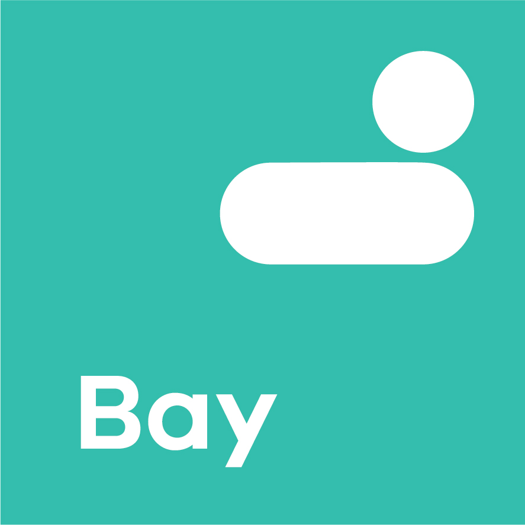

<i>Bay is the hosting and infrastructure layer for Single Digital Presence, delivered using amazee.io Lagoon.</i>

<!-- TABLE OF CONTENTS -->
# Table of Contents
* [About](#About)
  * [amazee.io Lagoon](#amazeeio-lagoon)
* [Use](#use)
* [Contribute](#contribute)
* [Support](#support)
* [License](#license)
* [Attribution](#Attribution)

# About
Bay is a fully managed platform and hosting environment that provides an open Platform as a Service model managed by SDP. It: 
 - is an open-source hosting platform based on Lagoon. 
 - allows agencies to build, test and deliver websites via the cloud.
 - is a Kubernetes-based (OpenShift) Docker container hosting platform with auto-scaling, auto-recovery and high-availability at core.
 - is based on open-source project Lagoon.

## amazee.io Lagoon
Lagoon solves what developers are dreaming about: A system that allows developers to locally develop their code and their services with Docker and run the exact same system in production. The same Docker images, the same service configurations and the same code.

# Use
Learn more from https://lagoon.readthedocs.io/en/latest/

# Contribute
[Open an issue](https://github.com/dpc-sdp/bay) on GitHub or submit a pull request with suggested changes.

# Support
[Digital Engagement, Department of Premier and Cabinet, Victoria, Australia](https://github.com/dpc-sdp) 
is a maintainer of this package.

# License
This project is licensed under [GPL2](https://github.com/dpc-sdp/bay/blob/master/LICENSE)

# Attribution
Single Digital Presence offers government agencies an open and flexible toolkit to build websites quickly and cost-effectively.

The Department of Premier and Cabinet partnered with Salsa Digital to deliver Single Digital Presence. As long-term supporters of open government approaches, they were integral to the establishment of SDP as an open source platform.

